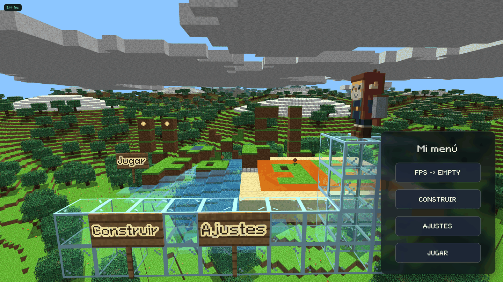
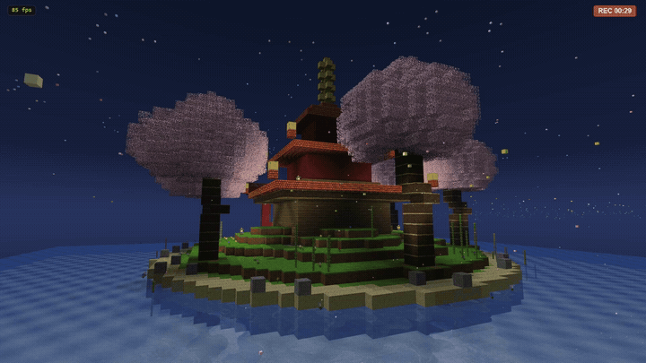

<p align="center">
  
</p>

<h1 align="center">VoxelForge</h1>

<p align="center">
  A lightweight, zero-dependency in-browser voxel editor and rendering engine running completely client-side via vanilla JavaScript and raw WebGL.
</p>

---

## Overview

**VoxelForge** started as a dedicated tool for crafting individual 16×16×16 voxel models, but evolved into a fully interactive sandbox environment capable of handling expansive spatial scenes.

It bridges asset creation and gameplay without frameworks or build steps: draw voxel objects, drop them into a Minecraft-style chunked world, rig them into articulated agents, and automate the entire experience directly from the JavaScript console.

<p align="center">
  
</p>

## Key Technical Features

- **Zero Dependencies**: Pure vanilla JavaScript with a custom-crafted, allocation-free WebGL rendering pipeline.
- **Dual Environment**: Seamless transition of voxel assets between an isolated 2D/3D editor (layer editing, free 3D painting, extrusion, carving, mirroring) and larger spatial worlds (up to 512×512×40 cells).
- **Extensible Scripting**: Full runtime automation via client-side JavaScript APIs (`game.*`), including custom OSD screens/menus, world autostart hooks, and rigged articulated entities.
- **Interactive Mechanics**: First-person player physics controller (scale transformation, flight mode, parkour ledge-grabs, collisions) alongside a digital logic signal & gate system (wires, levers, repeaters, pistons, torches).
- **Living World**: Flowing water and lava with swimming, sinking and buoyancy, plus behaviours attached to a *material* (`game.bloques.define`) so a block type can react to being stepped on, broken or powered.
- **Rendering & Shading**: Planar water reflections with animated wave distortion and Fresnel blending, incremental baked skylight, block-light 3D textures, ambient shading, and projected sun shadow maps.

---

## Quick Start

```bash
python3 server.py 8500
```

Nothing to install — `server.py` relies exclusively on Python standard library, serving the static client files as-is.

| URL | Description |
|---|---|
| `/` | The **Editor** — create and edit voxel models by layers or in free 3D |
| `/map/<name>` | An interactive **World** — explore, build, test, and script |
| `/map/` | Visual index and metadata of all saved worlds |
| `/fotos` | Gallery of in-world screenshots taken via `Alt+F` (full-res plus 800 px thumbnails) |
| `/videos` | Gallery of in-world screen recordings taken via `Alt+V` |
| `/images` | Icon workshop — assign drawings to UI slots and bake the PNGs the app uses |
| `/wiki` | Built-in manual, scripting guide, and API reference |

---

## Architecture & Layout

```
server.py         Static file server + JSON storage API (Python stdlib only)
servidor/         Server modules: mundos.py (world index), voxfmt.py (.vox reader)
web/              Front-end application: app.js (editor + world engine), index.html, style.css
redstone/         Digital logic and circuit simulation engine
assets/           Built-in voxel models and textures
data/             Saved worlds, drawings, agents, snippets, photos, videos, tickets
herramientas/     Standalone maintenance scripts (thumbnails, ticket images, migrations)
docs/ & wiki/     Technical manuals and in-app API documentation
tests/            Quality test suite (Playwright & Node runners)
```

## Testing

```bash
npm i && npx playwright install chromium
node correr_tests.js --node           # Node-only tests
node correr_tests.js --area=redstone  # Test specific subsystem
```

## License

[MIT](LICENSE)
